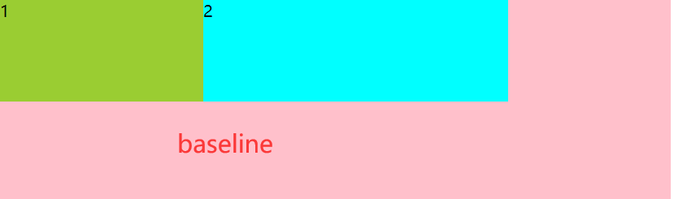

# CSS布局

#### 文档流布局

按照文档的顺序一个一个显示出来，块元素独占一行，行内元素共享一行

#### 脱离正常文档流布局

##### 浮动布局

使用float属性，使元素脱离文档流，浮动起来，常被用来将盒子置于左侧或右侧，同时让内容环绕其展示

##### 清除浮动

- 为不想要受浮动影响的元素添加clear属性。使用left值可以清除左浮动，right可以清除右浮动，both则会清除左右浮动。

  ```css
  .clear {
  	clear:both;
  }
  ```

- 用容器container包裹浮动元素和普通元素，在容器内添加一个css伪元素，并将其clear属性设置为both

  ```css
  .container::after {
      content:"";
      display:table;
      clear:both;
  }
  ```

- 块级格式化上下文（BFC）

  在容器内创建BFC

  BFC：页面上一个隔离的独立容器，容器里的子元素不会影响到外面的元素

  如何触发BFC？

  float值不为none

  overflow的值非visible（常用，设置为auto）

  display的值为inline-block，table-cell......

  position的值为absolute，fixed

  ```css
  .container {
  	overflow:auto;
  }
  ```

  避免BFC的负面影响

  ```
  .container {
  	//唯一作用是创建一个BFC
  	display: flow-root;
  }
  ```

#### 定位

通过 `position` 属性来进行定位，position默认为static，在块级维度上元素会一个接一个排列下去，滚动页面也会随着滚动。不同的position值会产生不同的参照点。

##### 相对定位

position：relative，它偏移的参照位是其原先在正常文档流的位置


以上是未加position：relative，即正常的文档流摆放


以上是给蓝色盒子加了position:relative,top:20px

可以看出，position：relative是根据原来的文档流位置进行的定位

设置了position：relative的元素在正常流中的位置会被保留，就像下图中所示，body盒子的高度仍然是元素移动前加另一个元素的高度


##### 绝对定位

position:absolute 该元素定位会相对于视口容器，除非某个祖先元素也是定位元素；给一个元素设置position：absolute属性可以将其完全从正常流中移除


不在正常文档流中，不占位置

由于给一个元素设置`position: relative`并不会将其从正常流中移除，所以通常这是一个不错的选择。给你想要相对的容器元素设置`position : relative`，就可以让绝对定位的元素相对其进行偏移。

##### 固定定位

position:fixed;固定定位的元素会相对于视窗进行定位，并且会从正常文档流中被移除，不会保留它所占据的空间。页面滚动时，固定定位的元素位置不会改变，会一直停留在屏幕上

#### 弹性布局

Flex 是 Flexible Box 的缩写，意为"弹性布局"，用来为盒状模型提供最大的灵活性。

任何一个容器都可以指定为 Flex 布局。

采用 Flex 布局的元素，称为 Flex 容器（flex container），简称"容器"。它的所有子元素自动成为容器成员，称为 Flex 项目（flex item），简称"项目"。

##### 容器的属性

###### flex-direction 决定主轴的方向(项目的排列方向)

```css
.box {
	flex-direction:row|row-reverse|column|column-reverse
}
```


- row（默认值）：主轴为水平方向，起点在左端

- row-reverse:主轴为水平方向，起点在右端
- column：主轴为垂直方向，起点在上端
- column-reverse：主轴为垂直方向，起点在下端

###### flex-wrap

默认情况下，项目都排在一条线（又称"轴线"）上。`flex-wrap`属性定义，如果一条轴线排不下，如何换行。

- nowrap（默认）：不换行
- wrap：换行，第一行在上方
- wrap-reverse：换行，第一行在下方

###### flex-flow

`flex-flow`属性是`flex-direction`属性和`flex-wrap`属性的简写形式，默认值为`row nowrap`。

```css
.box {
  flex-flow: <flex-direction> || <flex-wrap>;
}
```

###### justify-content属性（水平方向）

定义了项目在主轴上的对齐方式

```css
.box {
  justify-content: flex-start | flex-end | center | space-between | space-around;
}
```


- flex-start（默认值）：左对齐
- flex-end：右对齐
- center：居中
- space-around：项目两侧间隔相等
- space-between：两端对齐，项目间的间隔都相等

###### align-items(垂直方向)

定义项目在交叉轴上如何对齐

```css
.box {
    align-items:flex-end|flex-start|center|baseline|strech
}
```





- `flex-start`：交叉轴的起点对齐。
- `flex-end`：交叉轴的终点对齐。
- `center`：交叉轴的中点对齐。
- `baseline`: 项目的第一行文字的基线对齐。
- `stretch`（默认值）：如果项目未设置高度或设为auto，将占满整个容器的高度。

###### align-content属性

`align-content`属性定义了多根轴线的对齐方式。如果项目只有一根轴线，该属性不起作用。

```css
.box {
  align-content: flex-start | flex-end | center | space-between | space-around | stretch;
}
```


- flex-start:与交叉轴的起点对齐
- flex-end:与交叉轴的终点对齐
- center：与交叉轴的中点对齐
- space-between:与交叉轴两端对齐，轴线之前的间隔平均分布
- space-around：每根轴线两侧的间隔都相等。所以，轴线之间的间隔比轴线与边框的间隔大一倍。
- stretch（默认值）：轴线占满整个交叉轴

##### 项目的属性

###### order

定义项目的排列顺序。数值越小，排列越靠前，默认为0

```
item {
	order:<interger>
}
```


###### flex-grow

定义项目的放大比例，默认为0，即如果存在剩余空间，也不放大

```css
.item {
    flex-grow:<number>
}
```


如果所有项目的`flex-grow`属性都为1，则它们将等分剩余空间（如果有的话）。如果一个项目的`flex-grow`属性为2，其他项目都为1，则前者占据的剩余空间将比其他项多一倍。


###### flex-shrink

定义了项目的缩小比例，默认为1，即如果空间不足，该项目将缩小

如果所有项目的`flex-shrink`属性都为1，当空间不足时，都将等比例缩小。如果一个项目的`flex-shrink`属性为0，其他项目都为1，则空间不足时，前者不缩小。


负值对该属性无效。

###### flex-basis属性

`flex-basis`属性定义了在分配多余空间之前，项目占据的主轴空间（main size）。浏览器根据这个属性，计算主轴是否有多余空间。它的默认值为`auto`，即项目的本来大小。

```
.item {
  flex-basis: <length> | auto; /* default auto */
}
```


它可以设为跟`width`或`height`属性一样的值（比如350px），则项目将占据固定空间。

###### flex属性

flex属性是flex-grow,flex-shrink和flex-basis的简写，默认值为0 1 auto。后两个属性可选

常用的flex：1指的是flex-grow：1，即平分剩余大小

该属性有两个快捷值：`auto` (`1 1 auto`) 和 none (`0 0 auto`)。

建议优先使用这个属性，而不是单独写三个分离的属性，因为浏览器会推算相关值。

###### align-self属性

`align-self`属性允许单个项目有与其他项目不一样的对齐方式，可覆盖`align-items`属性。默认值为`auto`，表示继承父元素的`align-items`属性，如果没有父元素，则等同于`stretch`。

```
.item {
  align-self: auto | flex-start | flex-end | center | baseline | stretch;
}
```


该属性可能取6个值，除了auto，其他都与align-items属性完全一致。