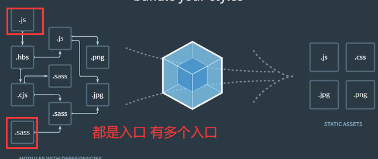
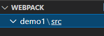
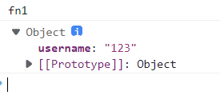
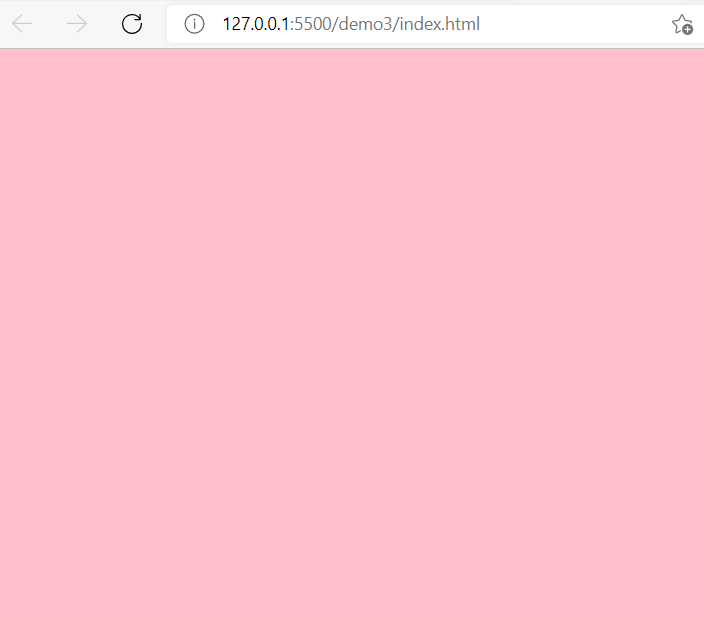

# webpack

webpack是一个用于现代js应用程序的静态模块化打包工具。当webpack处理应用程序时，他会在内部构建一个依赖图，此依赖图对应映射到项目所需的每个模块，并生成一个或多个bundle

### entry（入口）

入口起点指示webpack应该使用哪个模块，来作为构建其内部依赖图的开始，进入入口起点后，webpack会找出有哪些模块和库是入口起点直接或间接依赖的；默认值是./src/index.js;可在webpack.config.js里设置，例如：

webpack.config.js

```
module.exports = {
	entry: './path/to/my/entry/file.js'
}
```




### output（输出）

输出属性告诉webpack在哪里输出他所创建的bundle，以及如何命名这些文件。主要输出文件的默认值是./dist/main.js,其他文件默认放在./dist文件夹中;可在webpack.config.js中进行配置

```
const path = require('path');

module.exports = {
  entry: './path/to/my/entry/file.js',
  output: {
    path: path.resolve(__dirname, 'dist'),//想要bundle生成到哪里
    filename: 'my-first-webpack.bundle.js',//定义webpack bundle的名称
  },
};
```

###  loader

webpack只能理解js和JSON文件，这是webapck的自带能力。loader让webpack能够去处理其他类型的文件，并将它们转换成有效模块，以供应用程序使用，以及被添加到依赖图中；

在webpack的配置中，loader有两个属性：

1.test属性，识别出那些文件会被转换

2.use属性，定义出在进行转换时，应该使用哪个loader

webpack.config.js

```
const path = require('path');

module.exports = {
  output: {
    filename: 'my-first-webpack.bundle.js',
  },
  module: {
  //rules里定义了test和use
    rules: [{ test: /\.txt$/, use: 'raw-loader' }],
  },
```

### plugin（插件）

loader用于转换某些类型的模块，而插件则可以用于执行范围更广的任务。包括：打包优化，资源管理，注入环境变量。

想要使用一个插件，你只需要 `require()` 它，然后把它添加到 `plugins` 数组中。多数插件可以通过选项(option)自定义。你也可以在一个配置文件中因为不同目的而多次使用同一个插件，这时需要通过使用 `new` 操作符来创建一个插件实例。

webpack.config.js

```
const HtmlWebpackPlugin = require('html-webpack-plugin');
const webpack = require('webpack'); // 用于访问内置插件

module.exports = {
  module: {
    rules: [{ test: /\.txt$/, use: 'raw-loader' }],
  },
  plugins: [new HtmlWebpackPlugin({ template: './src/index.html' })],
};
```

在上面的示例中，`html-webpack-plugin` 为应用程序生成一个 HTML 文件，并自动将生成的所有 bundle 注入到此文件中。

### mode(模式)

通过选择 `development`, `production` 或 `none` 之中的一个，来设置 `mode` 参数，你可以启用 webpack 内置在相应环境下的优化。其默认值为 `production`。

```
module.exports = {
  mode: 'production',
};
```

#### 安装webpack

在webpack文件夹下

```
npm install webpack webpack-cli -g
```

#### 创建子文件夹

```
mkdir demo1
```

```
mkdir src //存放源代码
```



#### 初始化

进入demo1

```
npm init - y
```

#### 本地安装webpack依赖

demo1下

```
npm install webpack webpack-cli --save-dev
```

### (1).初体验，打包webpack能识别的json和js文件

##### 新建入口文件index.js

src/index.js

```
import data from './data.json'
function fn1(){
    console.log('fn1')
}
fn1()
console.log(data)
```

src/data.json

```
{
    "username" : "123"
}
```

##### 打包命令

开发环境下

```
webpack ./src/index.js -o ./dist/bundle.js --mode=development
```

入口文件‘./src/index.js’

打包后存放的地点'./dist/bundle.js'

模式为开发模式

生产环境下

```
webpack ./src/index.js -o ./dist/budle_production.js --mode=production
```

生产环境下比开发环境多了压缩代码和代码混淆

##### 测试打包结果

新建index.html文件

添加script标签

```
<script src="./dist/bundle.js/main.js"></script>
```

打开浏览器查看结果



打包成功，把两个文件打包成了一个main.js文件

### (1.1)通过配置webpack.config.js进行打包

其他和上面不变

##### 新建webpack.config.js文件

```
let path = require('path')
module.exports = {
    //入口文件
    entry:"./src/index.js",
    output:{
        //输出文件名称
        filename:"bundle.js",
        //输出的路径
        //绝对路径__dirname是当前绝对目录,将当前绝对目录和dist整合在一起
        path:path.resolve(__dirname,'dist')
    },
    //开发模式
    mode:'development'
}
```

##### 打包命令

```
webpack
```

### (2).配置loader完成样式打包

新建index.css文件

```
body {
	background-color:pink
}
```

index.js引入该index.css文件

```
import data from './data.json';
import './style.css';
function fn1(){
    console.log('fn1')
}
fn1()
console.log(data)
```

配置webpack.config.js

```
let path = require('path')
module.exports = {
    //入口文件
    entry:"./src/index.js",
    output:{
        //输出文件名称
        filename:"bundle.js",
        //输出的路径
        //绝对路径__dirname是当前绝对目录,将当前绝对目录和dist整合在一起
        path:path.resolve(__dirname,'dist')
    },
    //开发模式
    mode:'development',
    //loader的配置
    module:{
        //对某个格式的文件进行转换处理
        rules:[
            {
                test:/\.css$/,
                use:[
                    //use数组中的loader顺序是从下到上，从右到左逆序执行
                    //将js样式内容插入style标签里
                    "style-loader",
                    //将css文件转换为js
                    "css-loader"
                ]
            }
        ]
    }
}
```

下载对应loader

```
npm install style-loader css-loader --save-dev
```

打包编译

```
webpack
```

测试是否成功

新建index.html文件，引入打包后的bundle文件

```
<script src="./dist/bundle.js"></script>
```

结果



成功

### （3）配置plugin插件完成html模板打包

配置html-webpack-plugin插件

webpack.config.js

```
let path = require('path')
let HtmlWebpackPlugin = require('html-webpack-plugin')
module.exports = {
    //入口文件
    entry:"./src/index.js",
    output:{
        //输出文件名称
        filename:"bundle.js",
        //输出的路径
        //绝对路径__dirname是当前绝对目录,将当前绝对目录和dist整合在一起
        path:path.resolve(__dirname,'dist')
    },
    //开发模式
    mode:'development',
    //loader的配置
    module:{
        //对某个格式的文件进行转换处理
        rules:[
            {
                test:/\.css$/,
                use:[
                    //use数组中的loader顺序是从下到上，从右到左逆序执行
                    //将js样式内容插入style标签里
                    "style-loader",
                    //将css文件转换为js
                    "css-loader"
                ]
            }
        ]
    },
    //plugin的配置
    plugins:[
        new HtmlWebpackPlugin({
            template:'./src/index.html'
        })
    ]

}
```

下载对应插件

```
npm install html-webpack-plugin
```

编译

```
webpack
```

打包中多了一个html文件

