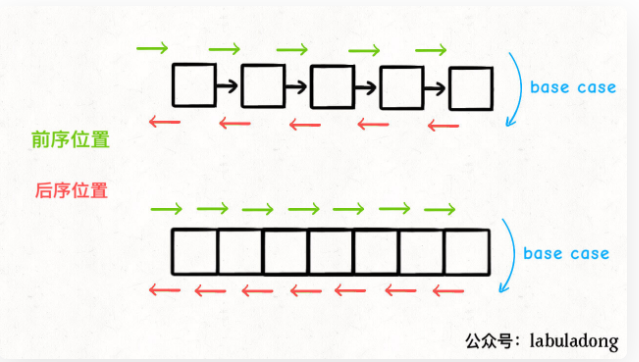
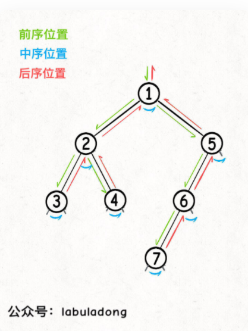

# 剑指offer树相关题目

深入理解前中后序

```js
traverse(TreeNode root) {
    if(root == null) {
        return;
    }
    //前序位置
    traverse(root.left)
    //中序位置
    traverse(root.right)
    //后序位置
}
```

把代码写在不同的位置，代码执行时机也不同



前中后序是遍历二叉树过程中处理每一个节点的三个特殊时间点：

- 前序位置的代码在刚刚进入一个二叉树结点的时候执行

- 后序位置的代码在将要离开一个二叉树节点的时候执行

- 中序遍历的代码在一个二叉树节点左子树都遍历完，即将开始遍历右子树的时候执行



每一个节点都有唯一属于自己的前中后序位置

**二叉树的所有问题，就是让你在前中后序位置注入巧妙的代码逻辑，去达到自己的目的**

你只需要思考每一个节点应该做什么，其他的不用你管，抛给二叉树遍历框架，递归会对所有节点做相同的操作。

二叉树题目的递归解法可以分两类思路：

- 第一类是遍历一遍二叉树得出答案(回溯算法框架)

- 第二类是通过分解问题计算出答案(动态规划框架)

一旦发现题目与子树有关，那大概率要给函数设置合理的定义和返回值，在后序位置写代码

遇到一道二叉树的题目时的通用思考过程是：**是否可以通过遍历一遍二叉树得到答案？如果不能的话，是否可以定义一个递归函数，通过子问题（子树）的答案推导出原问题的答案? 如果需要设计到子树信息, 建议使用后续遍历.**

##### jz55 二叉树的深度：返回左右子树最大深度+根结点

```js
TreeDepth(pRoot) {
	if(!pRoot){
        return 0;
    }
    let leftMax = TreeDept(pRoot.left);
    let rightMax = TreeDept(pRoot.right);
    //后序遍历位置，此时已经遍历完左右子树，获取了他们的深度，准备离开
    //此时记录下当前结点左右子树的最大深度
    let max = Math.max(leftMax,rightMax);
    //返回左右子树最大深度+根结点
    return max+1;
}
```

##### jz77 按之字形打印二叉树：设置队列queue，用while控制深度，for控制每层个数

通过遍历的方式求解，想清楚在哪个位置做哪些事

```js
function Print(root) {
	let queue = [];
	let res = [];
	let n = 0;
    if(!root) return [];
	queue.push(root);
    //while控制层
    while(queue.length!=0){
        let len = queue.length;
        let temp = [];
        //for循环控制每层的个数
        for(let i = 0;i<len;i++) {
            let node = queue.shift();
        	temp.push(node.val);
        	if(node.left){
            	queue.push(node.left)
        	}
        	if(node.right){
            	queue.push(node.right)
        	}
        }
        n++;
        if(n%2==0){
            res.push(temp.reverse())
        }else{
            res.push(temp)
        }
    }
    return res;
}
```

##### jz54 二叉搜索树的第k个结点:中序遍历后返回第[k-1]位置的值

找出二叉搜索树中第k小的结点

##### jz27 重建二叉树：分解子问题，先找出一个子树的左子树右子树，再让递归帮你找出每个子树的左子树和右子树

给出二叉树的前序遍历序列和中序遍历序列，然后进行二叉树的重建

##### jz26 树的子结构:先判断B是不是A的一颗子树的子树，再让递归帮我们判断B是不是A的其他子树的子树

判断B是不是A的子结构

```js
//当A,B的头节点不一样时，判断A的左子树里有没有B，A的右子树里有没有B
function isSubTree(A,B){
	if(A==null||B==null) return false
    return isSubTree(A.left,B)||isSub(A.right,B)||isSameTree(A,B)
}
//当A,B头节点一样时，判断B是否为A的子树
function isSameTree(A,B){
    //如果此时B遍历完了，且之前都一样时，说明B是A的子树
    if(B==null) return true
    //如果此时A遍历完了，B还有为遍历的，说明B不是A的子树
    if(A==null) return false
    //此时A，B都未遍历完，比较A，B此时指向结点的值是否相同
    if(A.val!==B.val) return false
    //让递归帮我们遍历他的左子树和右子树
    return isSameTree(A.left,B.left)&&isSameTree(A.right,B.right)
}
```

##### jz27 二叉树的镜像：反转一颗子树，让递归帮我们反转剩下的子树

```js
function reverse(A){
	if(A==null) return null
    [A.left,A.right] = [A.right,A.left]
    reverse(A.left)
    reverse(A.right)
    return A
}
```

##### jz33 二叉搜索树的后序遍历序列：先判断一棵子树的结果是否为后序遍历序列，再让递归帮我们判断其他子树

判断输入的整数数组是否为二叉搜索树的后序遍历结果

判断子树结果是否为后序遍历序列的方法：后序遍历---左右根，根在最后，二叉搜索树---左子树所有结点都比根小，右子树所有结点都比根大，问题的关键点是找到右子树开头的位置,也就是第一个比根大的位置

```js
function verifySequenceOfBTS(sequence) {
	if(sequence.length==0) return false;
    return verify(sequence)
}
function verify(sequence) {
    let len  = sequnce.length
    let root = sequence[length-1]
    let i = 0
    for(;i<len;i++){
        if(sequence[i]>root) break
    }
    //看看右子树后的数是否都比root大，大则返回true，否则为false
    if(sequence.slice(i,len-1).every( x => x>root)){
        //如果是true递归左右子树
        return verify(sequence.slice(0,i))&&verify(sequeue.slice(i,len-1))
    }else{
        return false
    }
}
```

